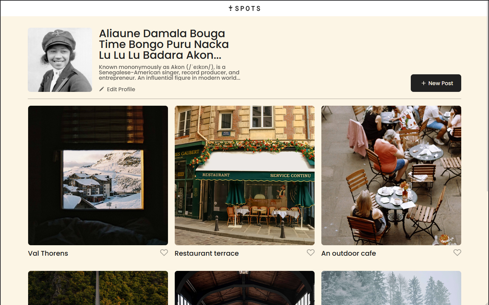
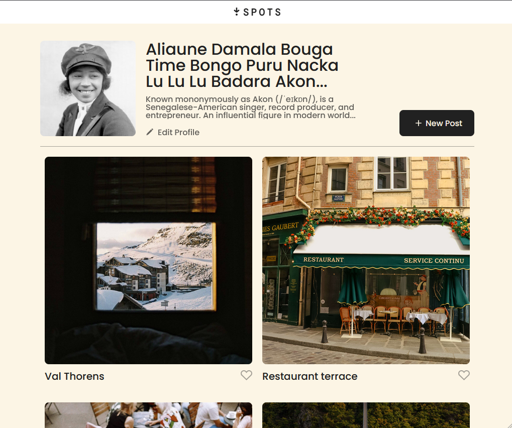
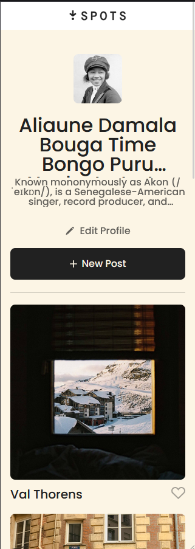

# Project 3: Spots

### Overview

- Intro
- Figma
- Images

**Intro**

This project is made so all the elements are displayed correctly on popular screen sizes. We recommend investing more time in completing this project, since it's more difficult than previous ones.

**Figma**

- [Link to the project on Figma](https://www.figma.com/file/BBNm2bC3lj8QQMHlnqRsga/Sprint-3-Project-%E2%80%94-Spots?type=design&node-id=2%3A60&mode=design&t=afgNFybdorZO6cQo-1)

**Images**

The way you'll do this at work is by exporting images directly from Figma — we recommend doing that to practice more. Don't forget to optimize them [here](https://tinypng.com/), so your project loads faster.

Good luck and have fun!

## Description

This project is one for a website/app that allows users to share locations and pictures of in a public space allowing other users to view and "Like" the photos taken. At the top is the menu-bar with the name of the project "Spots", immediately below that is the user's profile information, showing a profile picture adjacent to their name and "profile description" along with an edit profile button. On the opposing side to these is the "new post" button which allows users to upload a photo to the Spots website. Below the profile information is the images of different photos by multiple users along with their title and a "Like" button for the user to show their appreciation of this "Spot". This website is available across all devices and screen resolutions so you can enjoy it from anywhere!

## Details

The project uses HTML and CSS as well as a mix of Flexbox and Grid layouts to make a fully responsive page for any screen size!

## Resolution Previews

Project at a 1440 width resolution:

At a 1010 width resolution:

At a 320 width resolution:

## GitHub Pages Live Page Link

https://a7ic3.github.io/se_project_spots/

## Link to Video Presentation

https://drive.google.com/file/d/1sABQeNlEtKwIVQABqCeAxhM0ZwGo1zX-/view?usp=sharing
